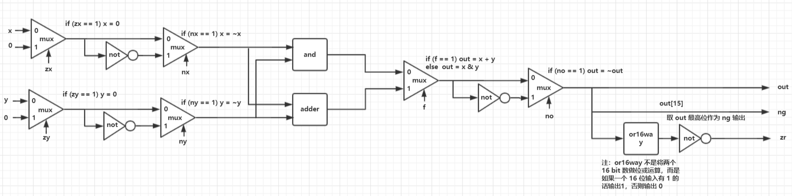
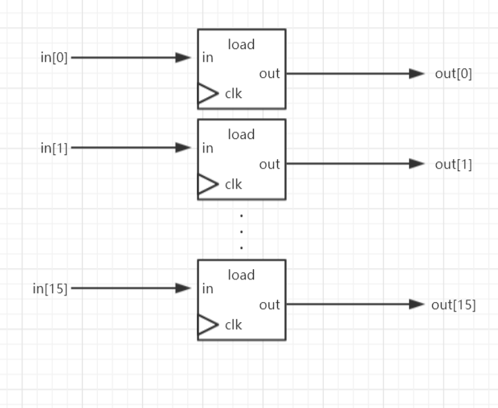
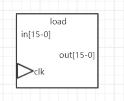
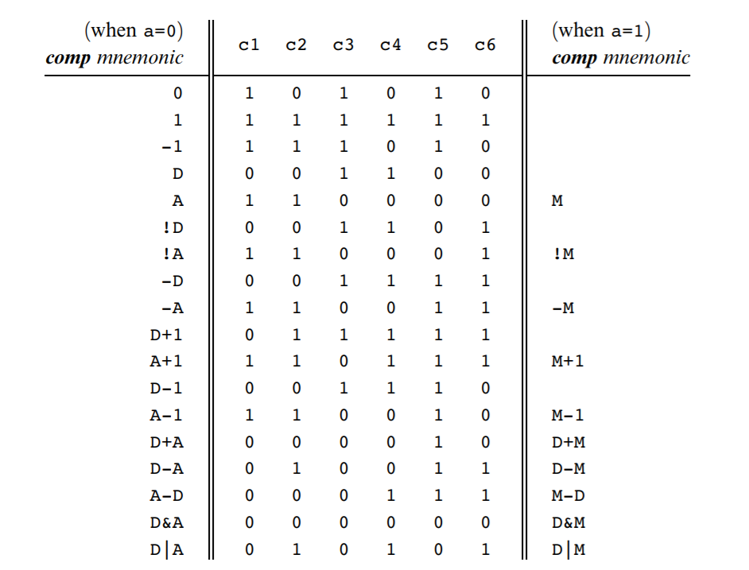
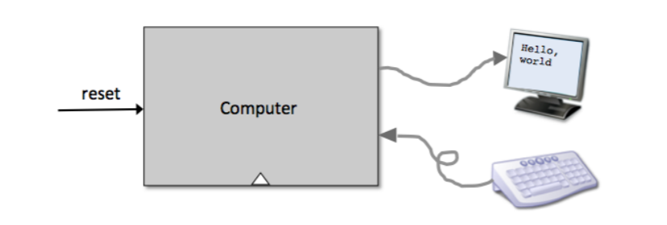
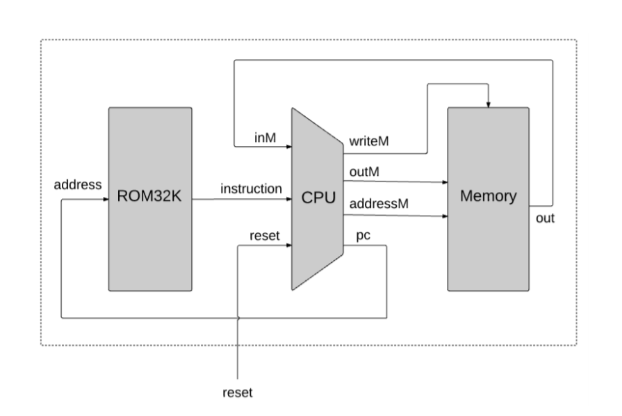
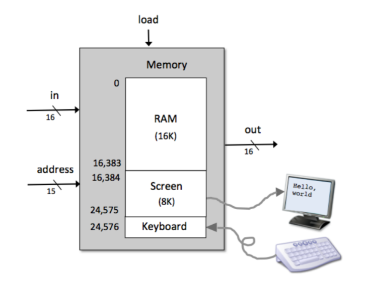

# nand2tetris

nand2tetris 课程介绍/总结。

课程主页：https://www.nand2tetris.org/

Coursera 慕课：[Nand2Tetris Part](https://www.coursera.org/learn/build-a-computer)[ ](https://www.coursera.org/learn/build-a-computer)[I](https://www.coursera.org/learn/build-a-computer) 、 [Nand2Tetris Part II](https://www.coursera.org/learn/nand2tetris2) 

## 简介

简单讲就是从与非门（nand）开始写了 CPU、RAM，最终组装成台简单的计算机（称为 HACK，**下文就用 HACK 指代之**），并在该计算机上实现了简单的软件生态（汇编器、虚拟机、高级语言、编译器、系统库）。课程还是挺有难度的，就是不断地做 project 一步步实现功能，涉及数电、计组、汇编、编译等知识，当然肯定都无法很深入，但深入这些东西也不是这门课的目的。我觉得这门课的重要意义在于将所学知识贯穿起来，让我们真的能学以致用，这就非常爽。从头一共做了十多个 project，难度也是不断加大，真的挺锻炼动手能力和编程水平。

## 1. 简单的逻辑门

不用纠结开始于哪个电路，实际上只用或非门、用与门和非门、用或门和非门、同时用与、或、非门都 ok，这几种组合都是能互相转换的，就当是从最基本的逻辑门电路开始的就行。

反正一开始就是用 nand 实现 and、or、not、xor 等基本逻辑门，同时还实现了非常重要的 mux（选择器/多路复用器）、dmux（或说是译码器）。由于建造的是 16 位计算机，还将同样功能的逻辑门堆成了 16 位的形式，比如 And16，就是接受两个 16 位 的输入 a、b，输出 out = a & b。像比较复杂的 Mux8Way16，就是用 16 个 8-1 数据选择器堆出来的，用于从 8 个 16 位的数据中选择一个。

## 2. 加法器、ALU

依次实现了半加器、全加器、16 位加法器，最后实现了一个简单的 ALU。

ALU 的实现是实现 HACK 计算机关键，它有多个控制位和输出，通过对控制位添加不同的控制信号，ALU 表现出不同的计算行为，实现了机器码指令到特定执行结果的映射。所以此处将详细讲解该 ALU 的实现。

总体来讲，该 ALU 实现对两个 16 位数 x、y 的计算，可以计算下列结果：x+y、x-y、y-x、0、-1、1、x、y、-x、-y、~x、~y、x+1、y+1、x-1、y-1、x&y 以及 x|y。

具体输出输出如下（以下控制位均为高电平有效）：

| 类型 | 名称    | 备注                                                         |
| ---- | ------- | ------------------------------------------------------------ |
| in   | x[16]   | 16 位二进制数                                                |
| in   | y[16]   | 16 位二进制数                                                |
| in   | zx      | zero x，将输入x 清零（不改变原 x 所在寄存器的值，但在后面的计算中将 x 当 0 处理） |
| in   | nx      | not x，将 x **按位**取反（zx 比 nx 先作用，所以如果 zx = 1 的话，nx 的结果是将 0 取反，结果是 -1 |
| in   | zy      | zero y，类似于 zx                                            |
| in   | ny      | not y，类似于 nx                                             |
| in   | f       | 如果 f == 1，out = x + y，否则 out = x & y                   |
| in   | no      | not out，将输出**按位**取反                                  |
| out  | out[16] | 计算结果，16 位                                              |
| out  | zr      | zero? 如果 out == 0，则 zr = 1，否则 zr = 0，**实现条件跳转的关键** |
| out  | ng      | negative? 如果 out < 0，则 ng = 1，否则 ng = 0，**实现条件跳转的关键** |

要注意控制位作用的先后顺序，ALU 对输出 x、y 的操作**依次**如下：

```
if (zx == 1) x = 0        // 16-bit 常量
if (nx == 1) x = !x       // 按位非
if (zy == 1) y = 0        // 16-bit 常量
if (ny == 1) y = !y       // 按位非
if (f == 1)  out = x + y  // 加
if (f == 0)  out = x & y  // 按位与
if (no == 1) out = !out   // 按位非
if (out == 0) zr = 1
if (out < 0) ng = 1
```

注意if 之间**没有 else**，前面的 if 有效，后面的照样被执行。

待会儿再看 ALU 内部的具体实现（实际上不难），我们先看上面这一串 if 逻辑是怎么实现前面一开始列举的 18 种计算的。

我们考虑一串 6 位机器码，**依次对应 zx、nx、zy、ny、f、no**，则对这串机器码取不同的值就可以产生不同的计算结果。

我们先说结论，输出和输入的 6 位机器码对应关系如下表（表后有证明）：

| out    | zx nx zy ny f no |
| ------ | ---------------- |
| 0      | 101010           |
| 1      | 111111           |
| -1     | 111010           |
| x      | 001100           |
| y      | 110000           |
| ~x     | 001101           |
| ~y     | 110001           |
| -x     | 001111           |
| -y     | 110011           |
| x + 1  | 011111           |
| y + 1  | 110111           |
| x - 1  | 001110           |
| y - 1  | 110010           |
| x + y  | 000010           |
| x - y  | 010011           |
| y - x  | 000111           |
| x & y  | 000000           |
| x \| y | 010101           |

如果你觉得这些对应关系是显而易见的，你完全可以跳过以下极大篇幅的证明。或者你可以挑几个证明看看，知道怎么证明就行了，需要的时候可以作为参考。

### ALU 控制位和输出对应关系的证明

废话不说，以下是 18 个对应关系的证明（请原谅我的啰嗦）： 

#### 1. 0 <= 101010

```
zx = 1 => x = 0
nx = 0 => x = x= 0
zy = 1 => y = 0
ny = 0 => y = y = 0
f =  1 => out = x + y = 0 + 0 = 0
no = 0 => out = out = 0
```

#### 2. 1 <= 111111

```
zx = 1 => x = 0
nx = 1 => x = ~0 = -1
zy = 1 => y = 0
ny = 1 => ny = ~0 = -1
f =  1 => out = x + y = -2
no = 1 => out = ~(-2) = 1 // 见引理

引理：x = ~(-(x + 1))
证明：
	首先由补码性质，我们知道 -x = ~x + 1
	用 -x 替换 x，有 x = ~(-x) + 1
	=> x -1 = ~(-x)
	用 x 替换 x -1，则 x = ~(-(x + 1))
```

#### 3. -1 <= 111010

```
zx = 1 => x = 0
nx = 1 => x = ~x = -1
zy = 1 => y = 0
ny = 0 => y = y = 0
f =  1 => out = x + y = -1 + 0 = -1
no = 0 => out = out = -1
```

#### 4. x <= 001100

```
zy = 1 => y = 0
ny = 1 => y = ~y = -1
f =  0 => out = x & y = x
no = 0 => out = out = x
```

#### 5. y <= 110000

类似于 x <= 001100

#### 6. ~x <= 001101

```
zy = 1 => y = 0
ny = 1 => y = ~y = -1
f  = 0 => out = x & y = x
no = 1 => out = ~out = ~x
```

#### 7. ~y <= 110001

类似于 ~x <= 001101

#### 8. -x <= 001111

``` 
zy = 1 => y = 0
nz = 1 => y = ~y = -1
f =  1 => out = x + y = x - 1
no = 1 => out = ~(x - 1) = -x // 见引理

引理：~(x - 1) = -x
证明：
	首先由补码性质，我们知道 -x = ~x + 1
	=> -(x + 1) = ~x
	用 x + 1 替换 x，则 -x = ~(x - 1)
```

#### 9. -y <= 110011

类似于 -x <= 001111

#### 10. x + 1 <= 011111

```
nx = 1 => x = ~x
zy = 1 => y = 0
ny = 1 => y = ~y = -1
f =  1 => out = x + y = ~x - 1
no = 1 = > out = ~out = ~(~x - 1) = x + 1 // 见引理

引理：~(~x - 1) = x + 1
证明：
	用 x 替换 ~x，则等价于证明 ~(x - 1) = ~x + 1
	在证明 -x <= 001111 时，我们证明了 ~(x - 1) = -x
	所以只要证明 -x = ~x + 1，由补码的性质，这显然成立
```

#### 11. y + 1 <= 110111

类似于 x + 1 <= 011111

#### 12. x - 1 <= 001110

```
zy = 1 => y = 0
ny = 1 => y = -1
f =  1 => out = x + y = x - 1
no = 0 => out = out = x - 1
```

#### 13. y - 1 <= 110010

类似于 x - 1 <= 001110

#### 14. x + y <= 000010

so easy.

#### 15. x -y <=  010011

``` 
nx = 1 => x = ~x
f =  1 => out = x + y = ~x + y
no = 1 => out = ~out = ~(~x + y) = x - y // 见引理

引理：~(~x + y) = x - y
证明：
	首先，由补码性质，有 -x = ~x + 1 => ~x = -x - 1
	所以只要证明 ~(-x - 1 + y) = x - y
	即 ~(-(x - y) -1) = x - y
	用 x 替换 -(x - y) - 1，则等价于 ~x = -x - 1，显然成立
```

#### 16. y - x <= 000111

类似于 x - y <= 010011

#### 17. x & y <= 000000

ez.

#### 18. x | y <= 010101

```
nx = 1 => x = ~x
ny = 1 => y = ~y
f =  0 => out = x & y = ~x & ~y
no = 1 >= out = ~(~x & ~y) = x | y // 德·摩根定律
```

终于证明完了。

经过这番证明，我们已经知道了利用我们要设计的 ALU 提供的 API 能做哪些计算以及能完成这些计算的原理，同时我们对机器码是如何控制 ALU 的有了比较深刻的理解。

按我的理解，计算机的基本指令可以分为计算和跳转（条件跳转/无条件跳转），前面讲的都是 ALU 的输入控制位对计算的控制，是实现计算指令的关键。而一开始我们讲到我们要设计的 ALU 输出除了计算结果外，还有 zr 和 ng 输出，分别在 out = 0 和 out <  0 时为 1，这两个输出正是实现条件跳转的关键。由此可见，我们要设计的 ALU 在 HACK 计算机基本指令的实现中扮演了至关重要的角色。

好了，bb 了那么多，上图！



（图可能不太清晰，请不要将图中的 ~ 看成 -）

可以看到，ALU 内部并不是很复杂，就是一些简单电路的拼接。值得注意的是，电路中的 and、not、mux、adder 都是 16 位的，实现起来都挺简单，就是将 16 个基本的逻辑电路连一下就行。图中还用到了 or16way，注释也提到了，它不是做两个 16 bit 数的位或运算，而是判断 16 个输出中是否有 1。电路中，我们一共用了 6 个 mux，对应于 6 个控制位，可见 mux 的重要性。

可以验证，这个简单的电路确实实现了 ALU API 的要求：

```
if (zx == 1) set x = 0        // 16-bit 常量
if (nx == 1) set x = !x       // 按位非
if (zy == 1) set y = 0        // 16-bit 常量
if (ny == 1) set y = !y       // 按位非
if (f == 1)  set out = x + y  // 加
if (f == 0)  set out = x & y  // 按位与
if (no == 1) set out = !out   // 按位非
if (out == 0) set zr = 1
if (out < 0) set ng = 1
```

ok，终于讲完了 ALU，这算是组合逻辑的综合应用，下面就是 RAM，涉及时序逻辑了。

## 3. 寄存器、PC、RAM

首先实现一个同步使能的 D 触发器，当作 1 位寄存器使用。此处懒得画电路图了，D 触发器算是数字逻辑时序逻辑部分的基本知识了。课程中将这样一个 D 触发器称为“Bit”，满足如下特性：如果不使能，则任意时刻，Bit 保持原状态；如果使能，在时钟上升沿，输出的数据被写入 Bit 中，也就是说 Bit 的状态更新为输入。

### 寄存器

有了这样一个 Bit，我们就能实现 16 位寄存器了。



图中省略了 load 和 clk，所有 load 和 所有 clk 分别接同一个信号。

这 16 个 Bit 的组合就是一个带有写使能的 16 位寄存器（以下说寄存器均指 16 位寄存器）了。



有了寄存器，我们就可以将多个寄存器拼起来，形成更大的内存单元了。

### RAM

我们先来实现一个 RAM8（指由  8 个寄存器组成的RAM，储存本领为 8个字，实际上是 16 个字节）。

一个 RAM8 有 8 个地址，于是我们需要使用 3 位宽的地址线去决定要操作或读取哪个寄存器，这可用一个 3-8 译码器（decoder / dmux）实现。类似地，输出是要从 8 个输出中选择一个输出，这就需要一个 8-1 数据选择器（mux）了。


为了连线的清晰起见，图中省略了 in 的连线，每个寄存器的 in 输入都与最左侧的哪个“悬空”的 in 相连。图中也省略了时钟信号，也是按所有寄存器都连接同一个时钟信号理解。

好了，这就实现了一个 RAM8，同样的使用一个 mux、一个 dmux 和 8 个 RAM8，我们可以造出 RAM64，类似地造出 RAM512、RAM4K、RAM32K 等。RAM 不是难点也不是重点，不再啰嗦。

### PC

最后讲讲 PC 程序计数器（16 位）的实现，输入是一个 in[16]、三个控制位 reset、load、inc，输出 out[16]。

功能描述如下：

```
if (reset == 1) out = 0
else if (load == 1) out = in
else if (inc == 1) out = out + 1
else out = out
```

注意和 ALU 不同，这边是有 else 的。可按以下电路图实现：


现在我们有了 ALU、PC，是时候造一个 CPU 了！

## 4. HACK 机器语言及其汇编

再造 CPU 之前，我们得描述它的行为，需求都不明确，我们又实现什么呢？首先我们要解决的问题是，我们希望 CPU 如何去执行一条机器码，就是说，给定机器码输入，我们要求 CPU 去做什么，这就是需求。下面就来明确需求，明确 HACK 机器码的功能。

我们要造的 HACK 计算机是 16 位的，每条机器指令就是一串 16 个 bits，我们将 HACK 的机器指令分为两类：A-instruction、C-instruction。

### A-instruction

A-instruction 设置 A 寄存器（Address Register，CPU 内置寄存器，其值表示当前读/写的内存单元的地址）的值，形式如下：

```
0  v v v v v v v v v v v v v v v // 汇编形式：@2333
```

其中 0 表示这是一个 A-instruction，是固定的，后面的每个 v 任意取 0 或 1，构成一个 15 bit 的二进制数（高位在前），表示地址。

如`0000 1001 0001 1101`表示将 A 寄存器的值设置为 2333，就这么简单。注意注释中的汇编形式，这只是个符号表示而已，便于直观地理解机器指令的含义，反正经过汇编器（后面我们会自己开发一个）处理后就变成了左边的机器码。

### C-instruction

C-instruction 的 C 应该表示组合（Combination）的意思，原谅我没能找到相关资料来解释其命名来由。

C-instruction 就相对复杂一些也更重要一些了，但和 x86 啥的相比绝对够简单。

```
1 1 1 a  c1 c2 c3 c4 c5 c6  d1 d2 d3  j1 j2 j3
```

C-instruction 控制了 3 件事情：

1. 计算什么？
2. 储存到哪？
3. 接下来做什么（跳转/条件跳转/下一条指令）？

前三个`111`是固定的，事实上仅要求最高位为 1，用于和 A-instruction 区分，后两个 1 只是按约定写成 1。

CPU 还内置了一个 D 寄存器，用于储存数据。前面还提到了 A 寄存器，其值就是当前读/写的内存单元的地址，我们将 A 对应的内存单元（属于外部寄存器）简记为 M（可以这样理解：M = RAM[A]）。在讲 ALU 时，我们讲到，当 zx nz zy ny f no 对应不同的组合时，我们进行以下 18 种计算：x+y、x-y、y-x、0、-1、1、x、y、-x、-y、~x、~y、x+1、y+1、x-1、y-1、x&y 以及 x|y。C-instruction 中的 c1 c2 c3 c4 c5 c6 就分别对应了 zx nz zy ny f no。当然我们需要确定 x，y 分别对应什么。在 CPU 内部，D 寄存器与 ALU 的 x 输入直接相连，A 和 M（当前内存单元对应的寄存器）与一个 16 位形式的 2 选 1 mux 相连，选择结果与 ALU y 输入相连。于是我们就知道了，y 要么是 A，要么是 M，这取决于 mux 的控制位。那 mux 的控制位是什么呢？就是 C-instruction 中的 a 了！

当 a = 0 时， mux 选择 A，当 a = 1 时，选择 M。下面盗张图来说明 a c1 c2 c3 c4 c5 c6 对计算（compute，简记为 comp）行为的控制：



请注意和 ALU 一节的对照，可以发现这个对应关系几乎一模一样。请将 c1 c2 c3 c4 c5 c6 看成 zx nx zy ny f no，将 D 看成 x，将 A 和 M 都看成 y。

好了我们现在知道了 C-instruction 是如何指定计算行为的，那计算结果储存到哪儿呢？这由 d1 d2 d3（dest）指定，详见下表：

| d1 d2 d3 | 助记符 | 备注                      |
| -------- | ------ | ------------------------- |
| 0 0 0    | null   | 不保存                    |
| 0 0 1    | M      | 储存到 RAM[A] 处          |
| 0 1 0    | D      | 储存到 D 寄存器           |
| 0 1 1    | MD     | 同时储存到 RAM[A] 和 D    |
| 1 0 0    | A      | 储存到 A 寄存器           |
| 1 0 1    | AM     | 同时储存到 A 和 RAM[A]    |
| 1 1 0    | AD     | 同时储存到 A 和 D         |
| 1 1 1    | AMD    | 同时储存到 A、RAM[A] 和 D |

非常容易理解，分别将 d1、d2、d3 理解成 A、M、D 寄存器的写使能即可。

现在还剩下 j1 j2 j3，这是用来根据计算结果决定跳转的（请回忆 ALU 的 zr、ng 输出）。

| j1 j2 j3 | 助记符 | 备注                                                         |
| -------- | ------ | ------------------------------------------------------------ |
| 0 0 0    | null   | 不跳转，简单地执行下一条指令                                 |
| 0 0 1    | JGT    | if (out  >  0) jump（out 为 ALU 输出，也就是计算表达式的结果） |
| 0 1 0    | JEQ    | if (out >= 0) jump                                           |
| 0 1 1    | JGE    | if (out == 0) jump                                           |
| 1 0 0    | JLT    | if (out <  0) jump                                           |
| 1 0 1    | JNE    | if (out <> 0) jump                                           |
| 1 1 0    | JLE    | if (out <= 0) jump                                           |
| 1 1 1    | JMP    | jump，无条件跳转                                             |

jump 到哪儿呢？实际上是跳到 A 寄存器指定的位置，前面讲到 A 寄存器指定了 RAM 的地址，事实上 A 也和 PC 的 in 输入相连，当 PC load 控制位为 1 （需要 jump）时，PC 被置为 A，也就是说下一条指令是 ROM[A]（HACK 计算机中将指令储存在一个 ROM 中）。

如果你将 j1、j2、j3 分别理解成 out < 0、out = 0、out > 0 的话，这就又很好理解了。

好了，现在我们从汇编代码角度（请理解成助记符）来理解下 C-instruction。

```
机器码：1 1 1 a  c1 c2 c3 c4 c5 c6  d1 d2 d3  j1 j2 j3
助记符: dest = comp; jump
其中 dest 是 destination，由 d1 d2 d3 指定，具体对应关系见上表
	 comp 表示 compute，是又 a c1 c2 c3 c4 c5 c6 决定的计算表达式
	 jump 由 j1 j2 j3 指定
由于 dest 和 jump 都可能为 null，所以实际形式可能是
	1. dest = comp
	2. comp; jump
	3. dest = comp; jump
注意光是计算一个 comp 而不指定 dest 或 jump 是无意义的，因为实际上这样的表达式白白浪费了一个时钟周期，却没有改变任何寄存器的值（没有改变任何状态）。
```

值得指出的是，我们知道无条件跳转是不依赖任何表达式的值的，也就是不管你表达式是啥，只要 j1 j2 j3 = 1 1 1，就一定会跳转。但按照约定，在 HACK 汇编中，我们用`0;JMP`来表示无条件跳转。

### HACK 汇编举例

我们举个简单的例子来理解下 HACK 汇编。我们用 HACK 汇编来实现将 `RAM[2] = RAM[0] + RAM[1]`的功能：

```
@0 // 机器码: 0 000000000000000，将 A 寄存器值置为 0，相当于 A = 0
D=M // 机器码 111 1 110000 010 000，故意这么排版，便于和上面的表对照, D = M = RAM[A] = RAM[0]
@1 // 0 000000000000001, A = 1
D=D+M // 111 1 000010 010 000, D = D + M = RAM[0] + M = RAM[0] + RAM[A] = RAM[0] + RAM[1]
@2 // 0 000000000000010, A = 2
M=D // 111 0 001100 001 000, RAM[2] = RAM[A] = M = D = RAM[0] + RAM[1]
```

请确保你理解了这段简单的汇编，上面的例子中并没有用到跳转，下面来个用到跳转的例子：计算 `RAM[0] + RAM[1] + ... + RAM[9]` 的值，保存到 RAM[10] 中。

先给出伪代码：

```
let RAM[10] = 0;
var int i;
let i = 0;
while (i < 10) {
	let RAM[10] = RAM[10] + RAM[i];
	let i = i + 1;
}
```

挺简单是吧？下面是汇编形式：

```
// 懒得写机器码了，不会该有的注释还是会有
// 下面的汇编代码前加上了行号，其实就是 ROM 地址编号，
// 以便于看清楚跳转到哪里，实际写汇编时不用写行号
 0: @0 // A = 0
 1: D=A // D = A = 0，注意这个技巧，当我们想给某个寄存器赋常量值 i 时，可以先 @i，再 dest = A
 2: @10
 3: M=D // RAM[10] = D = 0, 将 RAM[10] 清零
 4: @11
 5: M=D // RAM[11] = 0，RAM[11] 作为计数器，可以理解成定义 int i = 0，其中 i 的地址是 11
 6: @11 // while 开始，注意待会儿会跳回来
 7: D=M // D = i
 8: @10
 9: D=D-A // D = i - 10
10: @21 // A = 21，在要跳转时，需要先设置 A 的值
11: D;JGE // if (i - 10 >= 0) jump to end
12: @11
13: A=M // A = i
14: D=M // D = RAM[A] = RAM[i], 注意此时的 M 已经不是 13 行的 M 了
15: @10
16: M=D+M // RAM[10] += RAM[i]
17: @11
18: M=M+1 // i++
19: @6
20: 0;JMP // 无条件跳转到 6 处，进行下一轮循环
21: DONE // 不存在 DONE 指令，此处只是说明我们要进行的计算完成了。
```

应该还算好理解，不理解也没事，反正知道我们的 HACK 汇编能完成像循环这种工作就行了。

HACK 够简单，但功能足够强大。后面我们会用 HACK 汇编，模拟一个通用的栈式虚拟机，该虚拟机理论上能够执行绝大部分（所有？）程序（当然不是直接执行，需要在汇编层面进行一定的适配）。既然该虚拟机能够执行绝大部分程序，而它又是用 HACK 汇编模拟出来的，那也就说明 HACK 汇编能够执行绝大部分程序，同样，HACK 汇编可以简单地转换成等价的 HACK 机器码，而该 HACK 机器码能够被我们造的 HACK CPU 执行，所以我们可以说，我们要造的 HACK 计算机能够执行绝大部分（所有？）程序。


## 5. CPU、HACK 计算机

HACK 计算机采用哈佛架构，程序和运行时数据分开储存。运行时，我们可以改变数据所在的 RAM 中的值，但是不能改变程序指令所在的 ROM 的值，也就是说，在运行前，程序就必须加载好了。要运行不同的程序，就将不同的 ROM 接入/插入计算机，就像在掌上游戏机中插入不同的游戏卡来玩不同的游戏一样。

先讲讲 HACK 计算机的外观：



 HACK 计算机的通过键盘进行输入，通过显示器进行输出，此外还有一个 reset 按钮，用与式 PC 程序计数器指向程序 ROM 的地址 0 处。

下面拆开机壳看看内部是怎样的：



这幅图就很清晰了，一个 32K（字）的 ROM，一个 CPU 和一个 RAM，典型哈佛架构。PC 输出作为程序储存器的地址输入，所以 PC 总是指向要执行的指令的位置。一开始，我们按下了 reset，PC 被置为 0，ROM 地址 0 处的程序指令被送入 CPU，CPU 执行之，其间可能会对 RAM 进行读写，同时计算出 PC 的下一个值，用于决定下一个时钟周期执行哪条指令，通常情况下，PC 的值只是简单地加一，在要跳转的情况下，PC 的 load 控制位被置为 1，PC 的值变成 PC 的 in 输入，也就是下一条指令的地址。在下一个时钟周期，下一条要执行的指令被送入 CPU，重复上面的过程。程序的运行就是上面这样不断取指令并执行的过程。

我们不实现 ROM，因为其实 ROM 算是计算机外部的东西，ROM 是可插拔的，不同的 ROM 的内容就是不同的程序。我们实现了 RAM，事实上 RAM 也是通用的，从前面的实现过程看，模拟的实现一个 RAM 其实并不难，我们实现它只是为了使用它，它并不是重点、难点。接下来就让我们把目光放在 CPU 的实现上。


### CPU 设计

上一节中，我们已经知道了 HACK 汇编/HACK 机器码能够做的事，下面我们就来设计能够执行 HACK 机器码的 CPU 吧！

上图：


这个设计图和我们在 HACK 机器码及其汇编一节中的描述符合得非常好：

1. D 寄存器直连 ALU x 输入，A 和 M（inM）通过一个 mux 连接 ALU y 输入，ALU 的计算行为由 zx nx zy ny f no 指定。

2.  A 寄存器输出作为 addressM 输出，所以总有 M = RAM[A] 成立。
3.  A 寄存器输出还作为 PC 的 in 输入，当 loadPC 为 1（说明要跳转时），PC = A，下一条要执行的指令就是 ROM[A]
4.  ALU out 同时连接 M（outM）、D、A，就是说每个 C-instruction 的 comp 计算结果总是被送到 A M D 三个寄存器的输入（这样说不太严谨，因为 A 的输入是被左上角的 mux 选择过的），至于这三个寄存器是否要读取该结果，由相应的 load 控制位（对于 M 来说，控制位是写输出 writeM）决定。
5. A 寄存器的输入是一个 mux 的输出，为什么呢？如果当前是 A-instruction，比如说`@2333`，则 loadA 控制位必为 1，mux 的控制位 sel（图中命名为 isAinstruction，非常合理吧）也为 1，则有 A = A-instruction。等等，A 不是地址寄存器吗，怎么现在储存指令了？实际上，我们前面提到过，A-instruction 以 0 开头，紧跟着一个 15 位的地址，那自然可以将 A-instruction 看作一个 16 位地址了，只是它的最高位总是 0，所以将这个指令直接赋给 A 是合乎逻辑的，由此可见 HACK 机器指令设计的巧妙。但同时也引起了一个问题：地址最多只能是 15 位，所以仅支持 32K 的地址空间，但这对于我们这个玩具计算机来说完全够用了。

我们已经大概搞懂了 CPU 的设计图，具体实现的话主要就是**确定相关控制位的计算逻辑**。在实现控制位的逻辑之前，我们先来看看需求，即什么时候我们需要哪些控制位为 1，哪些为 0，需求确定后再实现就相当简单了。

#### 🧠模拟 CPU 运行

让我们举几个例子，在脑子中模拟这个 CPU 的运行：

从简单的 A-instruction 开始，假设此时输入 @2333（机器码：0000 1001 0001 1101 ），由于这个一个 A-instruction（根据最高位的 0 可知），左上角 mux 的 load，也就是 isAInstruction = ~instruction[15] = 1，mux 选择该指令作为 A 输入，并且在 isAInstruction 条件成立的情况下，loadA 也应该置为 1，这就导致 A 的值变成了指令输入，即 A = 2333。此时其他控制位情况如何？loadD、writeM 都为 0，因为这条指令没有对 D 和 M 赋值；loadPC 也应该是 0 ，因为这条指令没有指定跳转，PC 应该只是简单的加一；ALU y 输出 mux 的 selM 控制位取值不受当前指令影响，事实上，此时 ALU 计算啥都行，反正结果不会保存到任何一个寄存器中。

现在来看一个 C-instruction，比如说是 D=D+M;JGT（机器码：111 1 000010 010 001）。由于指令最高位为 1，说明这是一个 C-instruction，则 isAInstruction = 0，A 输入 mux 选择了 ALU 计算结果作为输入，但由于 loadA = instruction[5] = 0，所以这条指令不会对 A 赋值。然后考虑 ALU y 输出的 mux，由于计算表达式中包含了 M，所以该 mux 需要选择 M 而不是 A，应该有 selM = instruction[12] = 1，前面说过，输入的机器码如果是 C-instruction的话，instruction[12]（左数第 4 个）表示计算表达式操作 A 还是 M，此处是 1，表示操作 M。再来看计算表达式那 6 个 bit，值为 000010，分别对应 ALU 的 zx nz zy ny f no 控制位，由之前对 ALU 控制位和计算输出对应关系的讨论可知此时计算的是表达式 x + y 的值，此处也就是 D + M。最后看看左数最后三位，也就是 jump 控制位，其值为 001，对应`if(out > 0) jump`。jump 对应于 PC 的 loadPC 控制位，如果我们这样写，就实现了条件跳转功能：

```
positive = ~(ng | zr) // ng 和 zr 是 ALU 的输出
loadPC = (instruction[2] & ng) | (instruction[1] & zr) | (instruction[0] & positive)
```

事实上，上面的逻辑成立的前提是当前输入是 C-instruction（instruction[15] = 1），如果 instruction[15] = 0，那 loadPC 应该始终为 0。所以应该更正为：

```
loadPC = instruction[15] & ((instruction[2] & ng) | (instruction[1] & zr) | (instruction[0] & positive))
```

至于实际怎么连线应该难不倒我们。如果将所有连线都在 CPU 设计图中画出来就太乱了，所以此处就不画了。 

#### 控制位的实现

通过上面的两个例子，我们已经对如何决定每个控制位的值有了一定的感觉，下面给出所有控制位计算逻辑的伪代码。在按上图连接好 CPU 主要器件并按下面的描述加入一定的逻辑门实现控制位的计算逻辑后，我们实际上就实现了一个 CPU，😎！

```
// 这边建议你开两个窗口，一个显示上面的 CPU 设计图，一个显示此处的控制电路实现伪代码
// 伪代码是数据流形式，如何转换成逻辑门形式应该难不倒你

// A-instruction: 0 vvvvvvvvvvvvvvv
// C-instruction: 111 a c1c2c3c4c5c6 d1d2d3 j1j2j3

// 机器代码最高位是 0 的话就是 A-instruction，否则是C-instruction
isAInstruction = ~instruction[15] 
isCInstruction = instruction[15] // 这只是个中间变量

// 如果是 A-instruction 的话，loadA 自然为 1
// 否则如果 A 出现在 C-instruction 的 dest 部分（d1 = 1），loadA 也为 1
loadA = isAInstruction | instruction[5]

// 当 isCInstruction 且 D 属于 dest 时（d2 = 1），loadD 为 1
loadD = isCInstruction & instruction[4]

// 当 isCInstruction 且 M 属于 dest 时（d3 = 1），writeM 为 1
writeM = isCInstruction & instruction[3]

// C-instruction 中如果 a = 1，表示操作 M 而不是 A
selM = isCInstruction & instruction[12]

// 这部分已经讲解多次了，详见 ALU 的控制输入于计算结果的对应关系表
zx = instruction[11]
nx = instruction[10]
zy = instruction[9]
ny = instruction[8]
f  = instruction[7]
no = instruction[6]

// 当 isCInstruction 时，根据 3 个 jump 位决定跳转条件
positive = ~(zr | ng) // ALU 计算输出是否是正数，中间变量
loadPC = isCInstruction & ((instruction[2] & ng) | (instruction[1] & zr) | (instruction[0] & positive))

// 注意，设计图中 PC 没有标出 inc（自增）控制位
inc = ~loadPC // 实际上 inc = 1 也行，我们的 PC 实现中，loadPC 的优先级高于 inc

// 最后，在我们的 PC 实现中，reset 优先级是最高的，所以直接连就行了
// 不管此时 inc 和 loadPC 是否是 1，只要 reset = 1，PC 就变成 0
reset = reset

```

到此为止，我们就实现了一个 CPU 了！

### I/O

重新来看看这张图：


这是 HACK 机的内部结构，将我们实现的 CPU 按上图与 ROM 和 RAM 连接好（与 CPU 内部实现相比，简直毫无难度🙂），💣，一台 HACK 计算机就造出来了😱！

你可能还在疑惑，怎么就造出了台计算机呢？我们继续发挥想象力，来模拟以下这台机器的运行：

1. 你按下 reset，PC = 0，
2. ROM[PC] 处的指令传入了 CPU。
3. 根据这串指令对于的机器码不同位的信息，CPU 内部不同控制位的值被计算出来（loadA、loadD、selM、loadPC 等，请回想下上面对控制位的数据流描述）。
4. 对于每一条指令，A、M、D 这三个寄存器是否要保存计算结果都由计算出来的控制位唯一确定，ALU 要计算什么东西也有指令中的 6 个计算控制位确定，跳不跳转由指令的 3 个跳转位和 ALU 输出中的 ng zr 标志位决定。总而言之，在每个时钟周期内，每条指令最终造成的状态转变是确定的。我们亲自写了这个 CPU，我们清楚地知道，对于不同的指令输入，哪些控制位是 1，哪些是 0，每个寄存器最终状态是什么。总而言之，一切都符合预期，一切都井然有序的进行。32
5. 如果要跳转，loadPC 就已经被计算出来是 1，PC = A，指向下一条指令位置；不跳转的话 loadPC 被算出来是 0， inc 被算出是 1，PC 加一，下一个时钟周期简单地执行下一条指令。
6. 本时钟周期结束，PC 值已更新，在下一个时钟周期到来时，又从 2 处开始，不断循环。

它是怎么进行 I/O 的呢？换句话说，它是怎么接收键盘输入和显示图像/字符的呢？和传统做法一样：内存映射。传统冯·诺依曼架构中，程序也储存在 RAM 中，对于 CPU 而言，它只和 RAM 打交道，对其进行读写。CPU 要读取键盘输入或输出图像，都只能通过 RAM，所以可以在 RAM 中划出部分专用区域作为键盘、屏幕的内存映射。

具体到 HACK 机而言，在介绍 A-instruction 时，我们解释过，HACK CPU 仅支持 32 K 的内存地址空间，我们将前 16 K RAM（0-0x3FFF）作为主内存区使用，紧接着的 8K (0x4000-0x5FFF)作为屏幕映射，接下来的 1 （0x6000）个字的寄存器用作键盘映射，剩余的 8K（准确来讲是 8K - 1）地址空间不做使用。

再盗张图：



Screen 和 Keyboard 只是逻辑分区，物理上上面三个内存分区都属于同一块 32K RAM。

### 总结

到此为止，我们完成了硬件层面的开发，我们造了 CPU、RAM 并组装了一台 HACK 计算机。后面的项目中，我们会依次完成以下项目：

1. HACK 汇编转换成 HACK 机器码的 `hack-assember`
2. 将栈式虚拟机指令（如 push、pop、function、call、return 等）转换成 HACK 汇编的 `vm-translator`
3. 将面向对象的高级语言 JACK 编译成栈式虚拟机指令的 `jack-compiler`
4.  JACK 语言所依赖的系统函数库（内存管理库、图形库、数学库，这算实现一个简单的操作系统吧？）。

more fun to go 😎。

## 软件部分

见相应项目的 README.md。