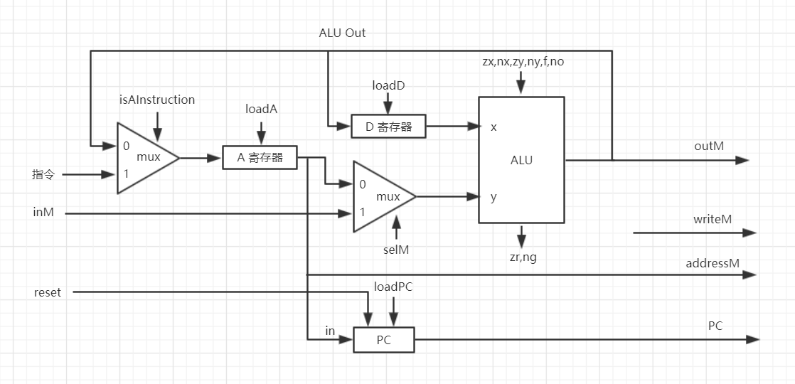

# CPU



```
// A-instruction: 0 vvvvvvvvvvvvvvv
// C-instruction: 111 a c1c2c3c4c5c6 d1d2d3 j1j2j3

// 机器代码最高位是 0 的话就是 A-instruction，否则是C-instruction
isAInstruction = ~instruction[15] 
isCInstruction = instruction[15] // 这只是个中间变量

// 如果是 A-instruction 的话，loadA 自然为 1
// 否则如果 A 出现在 C-instruction 的 dest 部分（d1 = 1），loadA 也为 1
loadA = isAInstruction | instruction[5]

// 当 isCInstruction 且 D 属于 dest 时（d2 = 1），loadD 为 1
loadD = isCInstruction & instruction[4]

// 当 isCInstruction 且 M 属于 dest 时（d3 = 1），writeM 为 1
writeM = isCInstruction & instruction[3]

// C-instruction 中如果 a = 1，表示操作 M 而不是 A
selM = isCInstruction & instruction[12]

// 这部分已经讲解多次了，详见 ALU 的控制输入于计算结果的对应关系表
zx = instruction[11]
nx = instruction[10]
zy = instruction[9]
ny = instruction[8]
f  = instruction[7]
no = instruction[6]

// 当 isCInstruction 时，根据 3 个 jump 位决定跳转条件
positive = ~(zr | ng) // ALU 计算输出是否是正数，中间变量
loadPC = isCInstruction & ((instruction[2] & ng) | (instruction[1] & zr) | (instruction[0] & positive))

// 注意，设计图中 PC 没有标出 inc（自增）控制位
inc = ~loadPC // 实际上 inc = 1 也行，我们的 PC 实现中，loadPC 的优先级高于 inc

// 最后，在我们的 PC 实现中，reset 优先级是最高的，所以直接连就行了
// 不管此时 inc 和 loadPC 是否是 1，只要 reset = 1，PC 就变成 0
reset = reset
```

